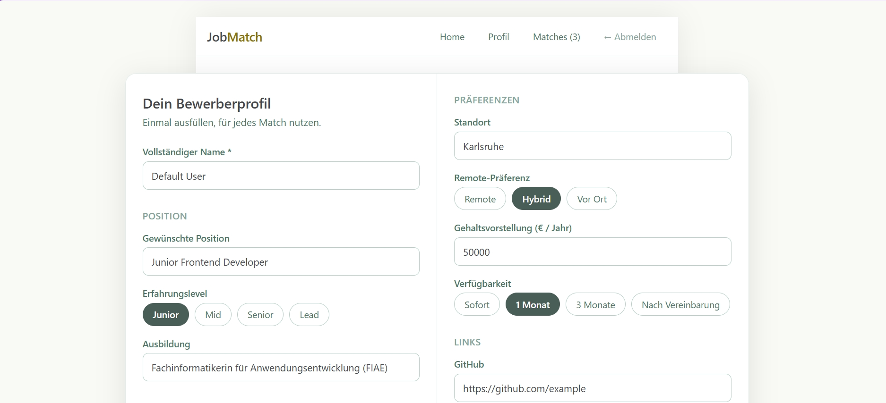
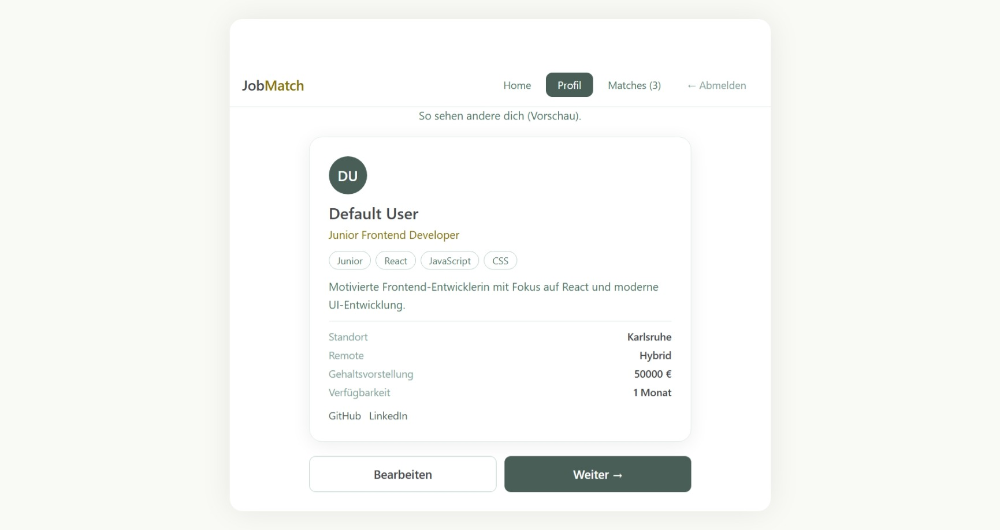
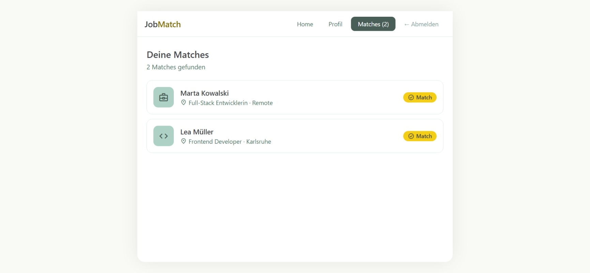

# JobMatch

## Screenshots






A two-sided job matching platform that connects job seekers and companies based on their profiles, skills, preferences, and requirements.

This project is open source and under active development. Issues, pull requests, and ideas are welcome, whatever your experience level.

## Idea

Instead of applying to every company separately, job seekers create a reusable profile containing the information typically required during the application process.

Companies create their own profiles and define their requirements, expectations, and working conditions.

The platform compares both sides and identifies suitable matches.

```text
Applicant Profile
        │
        │
        ▼
   Matching Engine
        ▲
        │
        │
Company Profile
        │
        ▼
     Match
```

The goal is not only to provide a score, but also to explain why two profiles match. A match is created when both sides express interest. The exact interaction does not have to be swipe based; swiping is only one possible interface for expressing interest.

## Features

- Account system with two roles, Admin (company) and User (job seeker); registration always creates a User account, Admin is a seeded account
- JWT authentication: short-lived access token held in memory on the client, long-lived refresh token in a rotating HttpOnly cookie with reuse detection
- Detailed, editable profiles: skills, experience level, salary expectations, remote preference, availability, links, and more
- Own profile preview after saving, with the option to go back and edit it any time
- Swipe interface for browsing matching jobs or candidates
- Match list showing all liked profiles
- Responsive layout: full-width app feel on mobile, a wider centered layout from tablet size up

## Tech Stack

**Frontend**
- React
- Vite
- react-tinder-card
- Material Symbols (Google Fonts) for icons

**Backend**
- ASP.NET Core Web API on .NET 10, Controller-based
- Entity Framework Core with SQLite
- ASP.NET Core Identity for users and roles
- JWT access tokens plus rotating refresh tokens (HttpOnly cookies, reuse detection)
- Swagger / OpenAPI

## Design

Colors: [colorhunt.co/palette/f5f7f8f4ce14495e5745474b](https://colorhunt.co/palette/f5f7f8f4ce14495e5745474b). Interactive states (hover, tints, accessible text variants) are derived from the base palette with HSL adjustments rather than separate hand-picked colors.

## Project Structure

```text
JobMatch/
├── backend/
│   ├── Program.cs
│   ├── Data/            # AppDbContext, DbSeeder
│   ├── SeedData/         # Demo profile data for the seeded accounts
│   ├── Entities/         # ApplicationUser, RefreshToken, Profile, Roles
│   ├── Auth/             # ITokenService, TokenService, JwtSettings
│   ├── Models/           # RegisterRequest, LoginRequest, AuthResponse
│   └── Controllers/       # AuthController, ProfileController, SecuredController
│
└── frontend/
    └── src/
        ├── components/    # Navbar, SwipeCard, TagInput, ToggleGroup, Icon, ...
        ├── pages/         # AuthForm, ProfileForm, ProfileCard, SwipeScreen, Matches
        ├── hooks/         # useBreakpoint
        ├── data/          # Mock jobs and candidates
        ├── api.js         # Access token in memory, refresh via HttpOnly cookie
        └── App.jsx
```

## Getting Started

### Prerequisites

- .NET SDK 10
- Node.js 20 or newer (includes npm)

### Cloning this repo

If you cloned this repository, skip straight to [Running](#running) — all packages below are already listed in `backend.csproj` and `frontend/package.json`, so `dotnet restore` and `npm install` pull everything in one go.

### Creating the projects from scratch

Only relevant if you are setting up a project like this one from zero rather than cloning this repo.

**Backend**
```bash
dotnet new webapi -controllers -n backend
cd backend
```
The `-controllers` flag matters: without it, .NET scaffolds a Minimal API project without a `Controllers/` folder, which this codebase relies on.

**Frontend**
```bash
npm create vite@latest frontend -- --template react
cd frontend
```

### Installing packages

**Backend (NuGet)**
```bash
cd backend
dotnet add package Microsoft.AspNetCore.Authentication.JwtBearer
dotnet add package Microsoft.AspNetCore.Identity.EntityFrameworkCore
dotnet add package Microsoft.EntityFrameworkCore.Sqlite
dotnet add package Microsoft.EntityFrameworkCore.Design
dotnet add package Swashbuckle.AspNetCore
```

**Frontend (npm)**
```bash
cd frontend
npm install
npm install react-tinder-card @react-spring/web --legacy-peer-deps
```
`react-tinder-card` powers the swipe gesture and depends on `@react-spring/web` for its animation, but only lists it as an optional peer dependency, so it needs installing explicitly. The `--legacy-peer-deps` flag is needed because `react-tinder-card`'s declared peer range does not yet include React 19; in practice it works fine despite the outdated metadata.

Icons come from Material Symbols (Google Fonts) rather than an npm package — see [Icons](#icons) below.

### Icons

Material Symbols is loaded via a font link, not an npm install. Add this to `index.html`:
```html
<link rel="preconnect" href="https://fonts.googleapis.com" />
<link rel="preconnect" href="https://fonts.gstatic.com" crossorigin />
<link
  href="https://fonts.googleapis.com/css2?family=Material+Symbols+Outlined:opsz,wght,FILL,GRAD@20..48,100..700,0..1,-50..200"
  rel="stylesheet"
/>
```

### Configuration

```bash
cd backend
dotnet user-secrets init
dotnet user-secrets set "Jwt:Key" "<a long random value>"
```

### Running

**Backend**
```bash
cd backend
dotnet run
```
Swagger UI is available at `/swagger` once the API is running. Two accounts are seeded on first start: `admin@jobmatch.com` / `Admin123!` (company side) and `user@jobmatch.com` / `User123!` (job seeker side), both with an example profile already filled in.

**Frontend**
```bash
cd frontend
npm run dev
```
The frontend expects the API at `https://localhost:7198` by default. Set `VITE_API_URL` to override this.

## Contributing

JobMatch is a work in progress and open to contributions from anyone interested. Whether it is a bug fix, a new feature, better test coverage, or a documentation improvement, pull requests are welcome.

If you are unsure where to start, open an issue describing what you would like to work on, or ask a question. All skill levels are welcome.

1. Fork the repository
2. Create a branch for your change
3. Open a pull request describing what you changed and why

## Roadmap

- Matching score with explanation, based on skills, experience, salary, and location
- Mutual interest model as the core matching mechanism, with swiping as one possible interaction among several
- Real job and candidate data instead of mock data
- Contact and application flow after a match

## License

This project is licensed under the MIT License. See the `LICENSE` file for details.